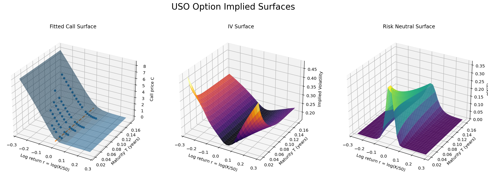
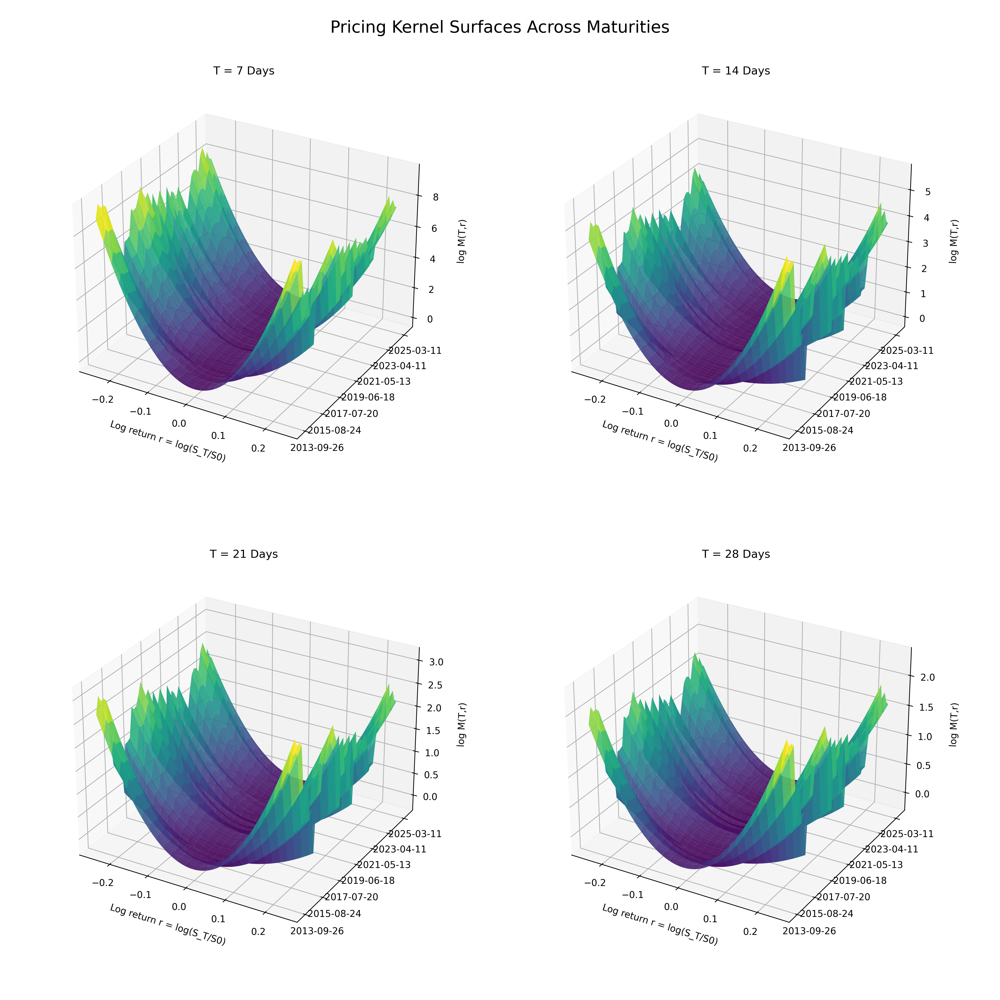

# PyDerivatives Replication: Zhang et al. (Asymmetric Returns and Higher Moments)

This repository contains the replication code for the paper submission:

 *“The asymmetric relationship between returns and implied higher order moments : replicated and revisited”* by Julian Beatty.

---


## Overview

This replication reproduces and extends the main empirical results using option-implied moments derived from crude oil ETFs.

The repository includes a **frozen version of the PyDerivatives 5.0 package**, ensuring that all results remain fully reproducible regardless of future updates to the main package.

The folder named "Replication Folder" contains the option and return history data from Optionmetrics and CRSP, which cannot be shared publicly in this repo. 

---

## Installation and Replication

To reproduce all results, use either the Conda-based installation (recommended) or a standard Python virtual environment.

---

### Option 1: Conda Environment (Recommended)

```bash
# 1. Create a clean Python 3.11 environment
conda create -n pyderivatives_replication python=3.11 -y

# 2. Activate the environment
conda activate pyderivatives_replication

# 3. Clone the repository
git clone https://github.com/Julian-Beatty/PyDerivatives_replication.git
cd PyDerivatives_replication

# 4. Install the package and dependencies
pip install -e .

# 5. Run the full replication
python USO_replication.py
```

---

### Option 2: Standard Python Virtual Environment (No Conda Required)

#### Windows

```bat
:: 1. Clone the repository
git clone https://github.com/Julian-Beatty/PyDerivatives_replication.git
cd PyDerivatives_replication

:: 2. Create a clean virtual environment
py -3.11 -m venv pyderivatives_replication_env

:: 3. Activate the environment
pyderivatives_replication_env\Scripts\activate

:: 4. Upgrade pip
python -m pip install --upgrade pip

:: 5. Install the package and dependencies
pip install -e .

:: 6. Run the full replication
python USO_replication.py
```
## New Features

